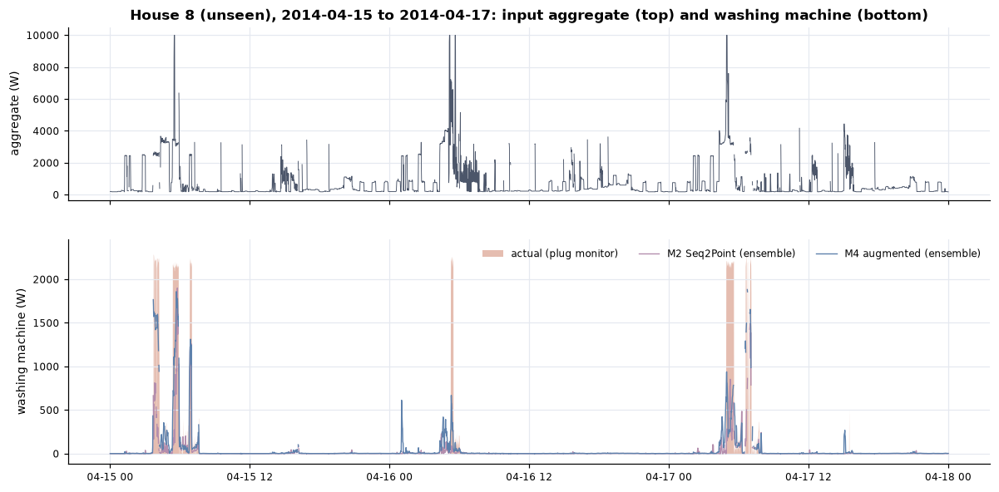
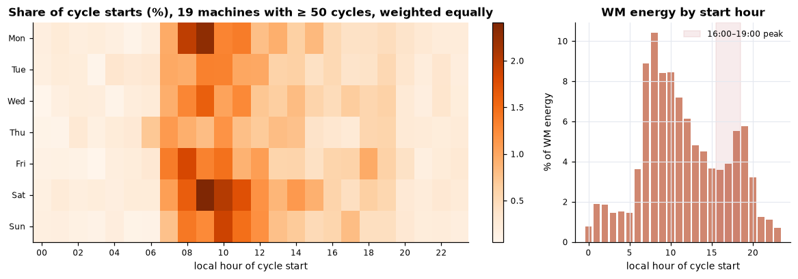
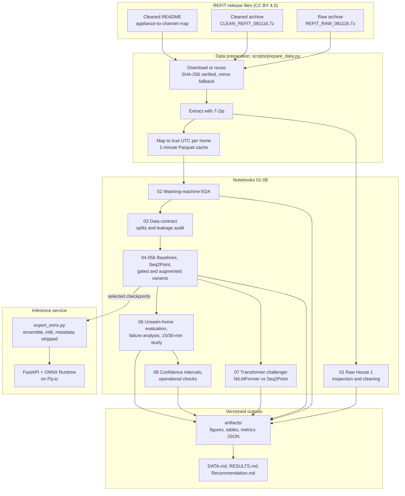
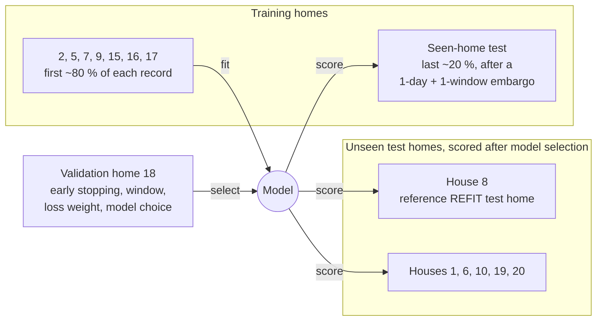
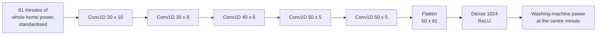
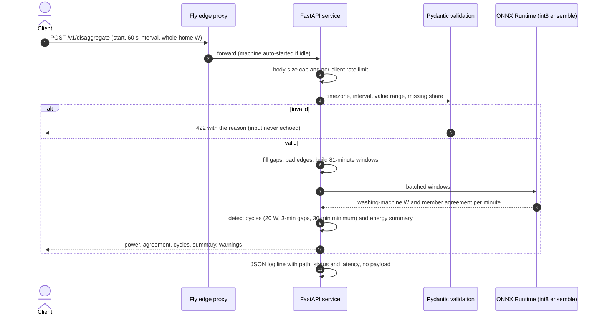
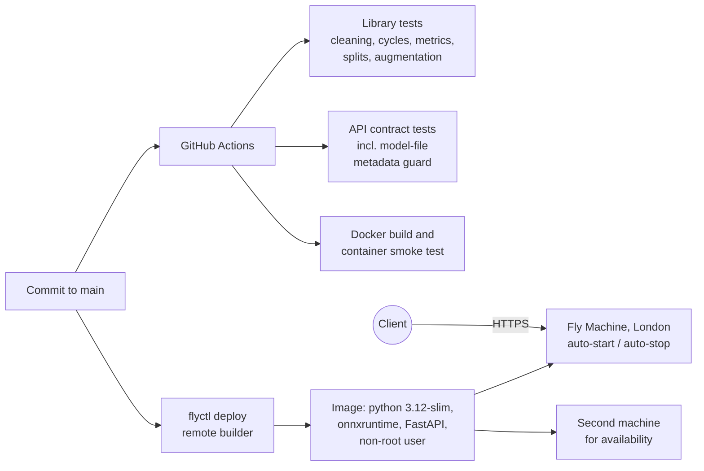

# REFIT NILM — washing-machine disaggregation from whole-home smart-meter data

[](https://github.com/amit-badave-04/refit-nilm-pipeline/actions/workflows/ci.yml)

An end-to-end, reproducible **non-intrusive load monitoring (NILM)** pipeline on the REFIT Electrical
Load Measurements dataset (University of Strathclyde, 20 UK homes, 2013–2015). It **cleans raw
smart-meter data**, including a timestamp problem in both public releases that this work found and
corrected. It **characterises washing-machine use** across 19 homes and **estimates washing-machine
power minute by minute from the whole-home signal alone**, evaluated on homes the model has never
seen. The selected model ships as an **int8 ONNX ensemble behind a FastAPI service on Fly.io**.

**🔗 Live API:** [refit-wm-nilm.fly.dev/docs](https://refit-wm-nilm.fly.dev/docs). Send 1-minute
whole-home power; get washing-machine power, detected cycles and energy back. In the docs, open
`POST /v1/disaggregate`, press **Try it out**, then **Execute**. Six real hours from an unseen test
home, with two recorded washes, are prefilled. A full real day is in
[`service/examples/`](service/examples/). The machine stops when idle, so the first request after a
pause takes a few extra seconds.

> Data: REFIT, CC BY 4.0 (Murray, Stankovic & Stankovic 2017). Code: MIT.

### Reviewing this in 10 minutes

| time | where | what to look at |
|---|---|---|
| 2 min | this page | [Results](#results) on unseen homes and the [model selection](#model-selection) table |
| 2 min | [DATA.md, section 2](DATA.md#2-raw-house-1-what-i-found-notebook-01) | the raw-clock finding, and the related timestamp problem in the official cleaned release |
| 3 min | [RESULTS.md](RESULTS.md) | "At a glance", then [section 4, failure analysis](RESULTS.md#4-failure-analysis) |
| 2 min | [Recommendation.md](Recommendation.md) | one page for a utility: uses, limits and one measurable saving |
| 1 min | [live API](https://refit-wm-nilm.fly.dev/docs) | run the prefilled example |

Code worth opening first: [`notebooks/06_evaluation_failure_analysis_resolution.ipynb`](notebooks/06_evaluation_failure_analysis_resolution.ipynb)
(evaluation on unseen homes), [`src/refit_nilm/cleaning.py`](src/refit_nilm/cleaning.py) (raw-data
rules) and [`service/app/main.py`](service/app/main.py) (the API).

---

## What it does

- **Raw-data cleaning with an audit trail.** Inspects raw House 1 (8.5 M rows), corrects the logger's
  clock, resolves overlapping files and duplicates, masks impossible readings as missing, resamples to
  1 minute and flags outages. An independent check against the official cleaned release agrees at
  **r = 0.999** on the aggregate and on the washing machine.
- **Washing-machine behaviour across homes.** 6,334 detected cycles in 19 homes: when people wash, for
  how long, how much energy, and where that energy goes (**76 % is water heating**).
- **Disaggregation from the aggregate.** A three-seed **Seq2Point** CNN ensemble finds **75 % of real
  washing cycles** in the reference unseen test home and cuts the daily washing-energy error by
  **42 %** relative to a no-information baseline.
- **Evidence-first evaluation.** The reference REFIT split plus five more unseen homes, a seen-home
  temporal test, energy-, minute- and cycle-level metrics, failure attribution to the appliances that
  caused it, and a 15/30-minute smart-meter study. A 2025 transformer is tested as a challenger
  under a rule committed before its full training run, and bootstrap intervals show how far the headline
  unseen-home numbers can be trusted.
- **A production-style inference service.** Torch-free ONNX runtime, validated inputs, rate limits,
  structured logs, a model card and contract tests in CI, deployed on Fly.io.
- **Reproducible.** Pinned environment, checksummed data and seeded, deterministic GPU training. A
  fresh clone regenerated every results table of notebooks 01–06 identically, and the transformer
  training of notebook 07 repeats bit for bit on the same GPU.

## Why washing machines are a hard disaggregation target

A washing machine is a **sparse, multi-phase** load. It is off about 97 % of the time. A wash is a
~2 kW water-heating block followed by an hour of 100–300 W drum movement and short spin bursts. The
heating block looks like a kettle, a dishwasher or an electric shower in the aggregate, and the long
tail sits inside ordinary background load. Two consequences shape this project:

1. **Metrics.** On House 8, "always off" scores an MAE of 24.6 W and the best model 23.6 W, so MAE
   barely moves on a sparse target. Model selection therefore uses energy-normalised error (NDE),
   daily energy error and cycle-level detection.
2. **Context.** The model must see a whole cycle around the minute it predicts, so it works on
   81-minute windows of the aggregate, the 1-minute equivalent of the reference 80-minute window.

## Results

### Unseen homes: the primary result

The primary model is the **Seq2Point three-seed ensemble**, chosen on the validation home before any
test home was scored. For NDE, 1.0 means predicting zero and lower is better. EpD is the mean absolute
daily washing-energy error.

| House 8 (reference REFIT test home) | always-off | weekday × hour profile | LightGBM | **Seq2Point ensemble** |
|---|---|---|---|---|
| NDE | 1.00 | 1.00 | 1.01 | **0.74** |
| daily energy error, EpD (Wh/day) | 574 | 536 | 531 | **335** |
| total-energy error over 18 months, SAE | 1.00 | 0.35 | 0.50 | **0.28** |
| cycle recall (share of real washes found) | 0 | 0.08 | 0.02 | **0.75** |
| cycle F1 | 0 | 0.03 | 0.02 | **0.56** |
| minute-level F1 (on ≥ 20 W) | 0 | 0.05 | 0.05 | **0.49** |

| Mean over six unseen homes (8, 1, 6, 10, 19, 20) | always-off | LightGBM | **Seq2Point ensemble** |
|---|---|---|---|
| NDE | 1.00 | 1.11 | **0.83** |
| daily energy error, EpD (Wh/day) | 308 | 356 | **181** |
| total-energy error, SAE | 1.00 | 1.30 | **0.31** |
| cycle F1 | 0 | 0.05 | **0.48** |

On later data from the training homes (the seen-home test) the same model reaches NDE 0.57 and minute
F1 0.61. Full tables, per-home scores and the failure analysis are in [`RESULTS.md`](RESULTS.md).

**How certain (notebook 08).** 95 % intervals from resampling whole days: House 8 NDE 0.72–0.76,
cycle F1 0.52–0.60. For the average over homes like these, resampling whole homes gives NDE
0.61–1.09, and a single new home varies far more: the six range from 0.42 to 1.40. The real
uncertainty is the next home, not the next month.



### Washing behaviour (19 homes, 6,334 clean cycles)

| | |
|---|---|
| typical wash | 68 min (90th percentile 118 min), 2.1 kW peak, 0.52 kWh |
| energy in water heating | 76 % of all washing-machine energy |
| heated vs unheated wash | 0.57 vs 0.19 kWh (median) |
| when | 44 % of washes start 07:00–12:00; Saturday and Monday mornings peak; 13 % start in the 16:00–19:00 network peak |
| frequency | median 4.0 washes a week per machine |
| sanity check | mean 0.55 kWh per wash vs 0.58 kWh in the UK Household Electricity Survey |



### What resolution the input needs

| six unseen homes, mean | NDE | daily energy error (Wh/day) | interval F1 |
|---|---|---|---|
| 1-minute input, output reported per 15 min | 0.92 | 173 | 0.51 |
| 1-minute input, output reported per 30 min | 0.87 | 176 | 0.52 |
| model trained on 15-minute input | 1.27 | 274 | 0.22 |
| model trained on 30-minute input | 1.14 | 264 | 0.23 |

The washing-machine signature lives in the minute-level shape of the heating block. 1-minute input is
what makes disaggregation work, and its results can then be reported at any coarser interval.

### Model selection

Each variant changes one thing relative to Seq2Point, and the transformer replaces it outright. Every
candidate is accepted or rejected on the validation home (House 18), with three seeds each unless stated:

| candidate | validation NDE | cycle F1 | decision |
|---|---|---|---|
| Seq2Point, W = 81 (reference) | 0.68 ± 0.05 | 0.60 ± 0.02 | kept |
| Seq2Point, W = 237 | 0.80 (seed 42) | 0.52 (seed 42) | window 81 chosen |
| on/off-gated Seq2Point (subtask gating) | 0.83 ± 0.03 | 0.47 ± 0.04 | not adopted |
| Seq2Point + distractor-appliance augmentation | 0.61 ± 0.08 | 0.57 ± 0.08 | not adopted (acceptance rule fixed before training) |
| NILMFormer transformer (KDD 2025), published recipe with three declared deviations † | 1.11 ± 0.06 | 0.07 ± 0.06 | not adopted (05b-style rule fixed before its full run) |
| **Seq2Point seed ensemble** | **0.60** | **0.64** | **primary** |

† On the minutes both models can score; on those minutes Seq2Point scores 0.675 ± 0.051 and
0.603 ± 0.016 (notebook 07).

## Stack choice and why

| Layer | Choice | Reasoning |
|---|---|---|
| Environment | Miniforge conda env (Python 3.12), `uv` for pip installs; `environment.yml`, `requirements-lock.txt`, `conda-lock-win64.txt` | One reproducible environment for notebooks, training and tests. |
| Data access | `scripts/prepare_data.py`: SHA-256-pinned archives, conda-forge 7-Zip, attributed release mirror | The portal's links sit behind a browser check; the script uses the direct file endpoints, falls back to an unmodified mirror and verifies the bytes either way. |
| Data processing | pandas 2.3 + PyArrow, Parquet cache | 7 GB of CSVs parse once into a ~10 MB-per-home 1-minute cache in true UTC. |
| Deep learning | PyTorch 2.14 (CUDA 13.0) on an RTX 5090 laptop GPU | Windows are gathered on the GPU by index and never materialised: ~17 s per epoch over 3.75 M windows, seeded and deterministic. |
| Models | Seq2Point CNN (Zhang et al. 2018); NILMFormer (KDD 2025) as a challenger | Seq2Point is the most replicated architecture on REFIT washing machines and small enough for three seeds of every variant; the transformer was tested against it and lost. |
| Baselines | LightGBM 4.7 on window features; usage profile; always-off | They show the deep model earns its complexity. |
| Notebooks | Jupyter, executed headless in order by papermill | Nine notebooks, each with the reason before every step and a closing summary. |
| Serving | ONNX Runtime 1.30 (int8 dense layers, per-channel; fp32 convolutions), FastAPI, Pydantic 2 | A 12.9 MB model in a ~100 MB image, with metric parity to PyTorch measured on a full test home. The convolutions stay fp32 because int8 convolutions ran 4–6× slower on the server CPU. |
| Hosting | Fly.io Machines (dedicated core), London, auto-stop | Pay only while serving; health-checked; non-root container. |
| Quality gates | pytest (67 tests); GitHub Actions: library tests, API tests, Docker build, container smoke test | Every cleaning rule, metric, split guarantee and API contract is pinned by a test. |

## Architecture



### Raw-data cleaning pipeline (notebook 01, `src/refit_nilm/cleaning.py`)

```mermaid
flowchart LR
    A["Raw Part 1 + Part 2<br/>8.5 M rows, 8-s polling"] --> B["Wall-clock to UTC<br/>before sorting;<br/>repeated autumn hour<br/>resolved by file order"]
    B --> C["Resolve Part 1 / Part 2<br/>overlap: keep the<br/>denser Part 1"]
    C --> D["Duplicates: exact rows<br/>dropped, last poll<br/>kept per instant"]
    D --> E["Impossible values to NaN,<br/>not 0: IAM over 4 kW,<br/>sentinels, aggregate<br/>over 23 kW"]
    E --> F["Event rows carried<br/>forward up to 120 s"]
    F --> G["1-minute mean<br/>on a regular UTC grid"]
    G --> H["Gaps up to 3 min filled;<br/>longer gaps flagged,<br/>never interpolated"]
    H --> I["920,031 minutes<br/>86.8 % valid<br/>r = 0.999 vs official"]
```



### Validation design



Splits are by home, and no input window crosses a split or a home boundary (audited: zero).
Normalisation statistics come from training targets only, and the inputs are the aggregate only.

### Model: Seq2Point



Three seeds (42, 10, 20) are trained identically and averaged. For deployment, the three networks,
the input standardisation and the conversion back to watts are exported as one ONNX graph.

### How a request is served



### Build, test and deploy



## Data integrity

- **The clock is corrected, not assumed.** REFIT's raw `Unix` column is UK wall-clock time: there are
  no readings in the skipped spring hour and twice the readings in the repeated autumn hour. The
  official cleaned files are true UTC only until each home's raw Part 1 ends (about 1 Oct 2014) and
  wall-clock time afterwards. Every series here is mapped to true UTC per home, and hour-of-day uses
  Europe/London local time. Evidence: `artifacts/tables/nb01_clock_change_hours.csv` and
  `nb01_official_time_regime.csv`.
- **Missing is not off.** Sensor faults and outages become missing values, never zeros.
  Forward-filled flat lines in the cleaned release (an hour of identical readings) are detected and
  excluded.
- **Labels come from the dataset's own map.** The appliance-to-channel map is parsed from the README
  and cross-checked against the reference code of the published REFIT split.
- **Every number has a source.** Each figure in the documents is produced by a notebook and saved in
  `artifacts/`; an independent review cross-checked the documents against those files.

## Evaluation methodology

| metric | what it answers |
|---|---|
| NDE = sqrt(Σ(ŷ−y)² / Σy²) | overall error relative to the target's energy (1.0 = predicting zero) |
| SAE, EpD | error in total energy over the period, and mean absolute error per day |
| MAE, MAE_ON | average error per minute, and while the machine is really running |
| precision, recall, F1 at 20 W | minute-level on/off agreement |
| cycle precision, recall, F1 | washes detected on prediction and truth with the same rule, matched at temporal IoU ≥ 0.5 |
| energy recovered, energy added | share of true energy found, and false energy predicted, as % of true energy |
| generalisation loss | change from seen to unseen homes (Klemenjak et al. 2019) |

## Production hardening (service)

- **Inputs validated at the boundary:** timezone-aware start, 1-minute interval only, 81–2,880
  readings (configurable), values 0–25 kW, at most 10 % missing, unknown fields rejected.
- **Bounded cost per request:** a 2 MB body cap, a per-client rate limit of 30 a minute, and a
  request cap sized from measured latency.
- **Model integrity:** the ONNX file's SHA-256 is checked against the model card at start-up.
  Exporter metadata is stripped, and a CI test fails if build-machine paths ever ship.
- **Privacy:** logs record path, status, latency and size only, and validation errors never echo data.
- **Container:** a slim Python 3.12 base, a non-root user and a health check on `/health`.
- **Parity:** on a full unseen home the quantised model scores NDE 0.737 and cycle F1 0.566, against
  0.737 and 0.564 for the PyTorch ensemble (`artifacts/metrics/onnx_parity.json`).

Usage, endpoints, latency and the real-day example: [`service/README.md`](service/README.md).

## Reproduce it

Tested on Windows 11 with Miniforge and an RTX 5090 laptop GPU. It also runs on Linux and macOS, and on
CPU, where training is slower.

```bash
# 1. environment
mamba env create -f environment.yml
conda activate refit-nilm

# 2. PyTorch with CUDA (Blackwell GPUs need a CUDA >= 12.8 build; CPU: --index-url https://download.pytorch.org/whl/cpu)
uv pip install torch==2.14.1 --index-url https://download.pytorch.org/whl/cu130
uv pip install -e . "onnx==1.23.2" onnxscript "onnxruntime==1.30.0" fastapi "uvicorn[standard]" httpx pytest-cov

# 3. Jupyter kernel used by the notebooks
python -m ipykernel install --user --name refit-nilm --display-name refit-nilm

# 4. data: download (or reuse data/), verify SHA-256, extract, build the 1-minute cache (~7 GB)
python scripts/prepare_data.py

# 5. tests, then every notebook in order (about 1.5 h with a laptop GPU; writes artifacts/)
python -m pytest -q
python scripts/run_notebooks.py

# 6. export the ensemble and run the service locally
python scripts/export_onnx.py --checkpoint artifacts/models/m2_seq2point_w81_s42.pt artifacts/models/m2_seq2point_w81_s10.pt artifacts/models/m2_seq2point_w81_s20.pt --name wm-seq2point-ensemble-w81 --card-extra artifacts/metrics/model_card_eval.json
cd service && uvicorn app.main:app --port 8080
```

**Reproducibility check:** a fresh clone run end to end with these steps regenerated every results
table of notebooks 01–06 identically (largest difference 1.5e-5, in one LightGBM cell) and the training curves to five
decimals (`artifacts/metrics/reproducibility_check.json`). Notebook 07's transformer training uses
PyTorch's deterministic algorithms, and two runs of one seed give bit-identical weights
(`artifacts/metrics/seq2seq_determinism_check.json`). Notebook 08 involves no training.

## Assumptions and preprocessing decisions

- All series are 1-minute means on a regular UTC grid; the mean preserves energy.
- Gaps of up to 3 minutes are forward-filled, following the 1-minute REFIT protocol of Petralia et al.
  (KDD 2025). Longer gaps stay missing and are never used as targets.
- A washing cycle is power ≥ 20 W, with off-gaps under 3 minutes bridged and a minimum length of
  30 minutes (Kelly & Knottenbelt 2015), checked for sensitivity.
- The aggregate is clipped to 0–10 kW and the washing machine to 0–4 kW. Input windows with more than
  10 % missing minutes are not used.
- Homes used for modelling have exactly one washing machine, no rooftop PV and no documented machine
  change.

## Design trade-offs

- **Seq2Point over a Transformer, now tested.** NILMFormer (KDD 2025) lost on validation by a wide
  margin, under a rule fixed before its full training run; cost was not the reason, since its
  published tiled inference is cheaper than Seq2Point. Seq2Point is proven on this dataset and fast
  enough to train three seeds of every variant.
- **Changes tested one at a time.** The gated and the augmented models each differ from Seq2Point in
  one respect, so their effect can be attributed; acceptance was decided on validation only.
- **A seed ensemble as the shipped model.** It has the best validation scores at no extra training
  cost.
- **Lightweight, tested components instead of a NILM framework.** The protocol follows NILMTK-contrib
  and the cited papers; the pieces needed are short, unit-tested and dependency-light.
- **int8 ONNX for serving.** A quarter of the size, no PyTorch in the image, and metric parity
  measured on a whole test home rather than assumed.

## AI tools used

AI coding assistants were used for code drafting, documentation editing and literature lookup. All
analysis decisions, verification of results and interpretation are my own.

## Roadmap

- **Transformer, second attempt:** more training homes, early stopping by cross-validation over
  homes, and a tuning budget matched to Seq2Point's. The first attempt (notebook 07) did not transfer.
- **More appliances from the same aggregate:** dishwasher and kettle heads sharing the trunk.
- **Richer electrical inputs:** reactive power and current harmonics from in-home meters, which
  separate a motor from a resistive heater.
- **New-market adaptation:** fine-tuning the dense layers on a small plug-metered panel.
- **Service:** a calibrated on-probability and drift monitoring.

## Repo map

```
├── README.md, DATA.md, RESULTS.md, Recommendation.md, CITATIONS.md
├── src/refit_nilm/        library used by every notebook (tested)
│   ├── io.py              download, checksum and mirror, extraction, README parsing, UTC-correct loader
│   ├── cleaning.py        raw-data inspection and cleaning steps
│   ├── cycles.py          washing-machine activation rule, threshold checks
│   ├── datasets.py        label masks, splits, leakage-safe window indices, resampling
│   ├── augment.py         training-time augmentation with real appliance activations
│   ├── features.py        window features (LightGBM) and usage profile
│   ├── models/seq2point.py  Seq2Point and gated Seq2Point
│   ├── models/nilmformer.py NILMFormer (KDD 2025), ported with its Apache-2.0 notice
│   ├── train.py           GPU training loop, early stopping, checkpoints
│   ├── train_seq2seq.py   the same for sequence-to-sequence models
│   ├── uncertainty.py     day-block, stationary and cluster bootstrap; event-metric variants
│   └── metrics.py         NDE, SAE, EpD, MAE(_ON), F1, AUPRC, cycle-level and energy-split metrics
├── notebooks/             01–08 incl. 05b, executed .ipynb
├── scripts/               prepare_data, run_notebooks, export_onnx, check_onnx_parity, check_nilmformer_port, edit_markdown
├── tests/                 library unit tests
├── service/               FastAPI + ONNX service, tests, Dockerfile, fly.toml, real-day example
├── artifacts/             figures, tables, metrics JSON, training logs
├── data/                  README + manifest (sources, SHA-256); archives and caches rebuilt
├── research/              reading list, protocol notes, script to fetch the open-access papers
├── LICENSES/              Apache-2.0 text for the adapted NILMFormer module
├── environment.yml, requirements-lock.txt, conda-lock-win64.txt
└── .github/workflows/ci.yml
```

| Document | Contents |
|---|---|
| [`DATA.md`](DATA.md) | dataset coverage, raw-data findings, cleaning decisions |
| [`RESULTS.md`](RESULTS.md) | washing-machine EDA, model results, validation, failure analysis, resolution study |
| [`Recommendation.md`](Recommendation.md) | one-page, utility-facing summary and energy-saving opportunity |
| [`CITATIONS.md`](CITATIONS.md) | research used and what was adopted from each paper |

## Licence and data

Code: MIT ([`LICENSE`](LICENSE)), except
[`src/refit_nilm/models/nilmformer.py`](src/refit_nilm/models/nilmformer.py), which is adapted from
NILMFormer (© 2025 EDF, Apache-2.0; licence text in [`LICENSES/Apache-2.0.txt`](LICENSES/Apache-2.0.txt);
the changes are listed at the top of the file). Data: REFIT Electrical Load Measurements, University of Strathclyde,
CC BY 4.0 (Murray, Stankovic & Stankovic 2017, *Scientific Data* 4:160122). `scripts/prepare_data.py`
downloads it from the university portal and falls back to an unmodified, attributed copy on the
release [`refit-data-081116`](https://github.com/amit-badave-04/refit-nilm-pipeline/releases/tag/refit-data-081116).
Both routes are checked against the SHA-256 in [`data/manifest.json`](data/manifest.json).
