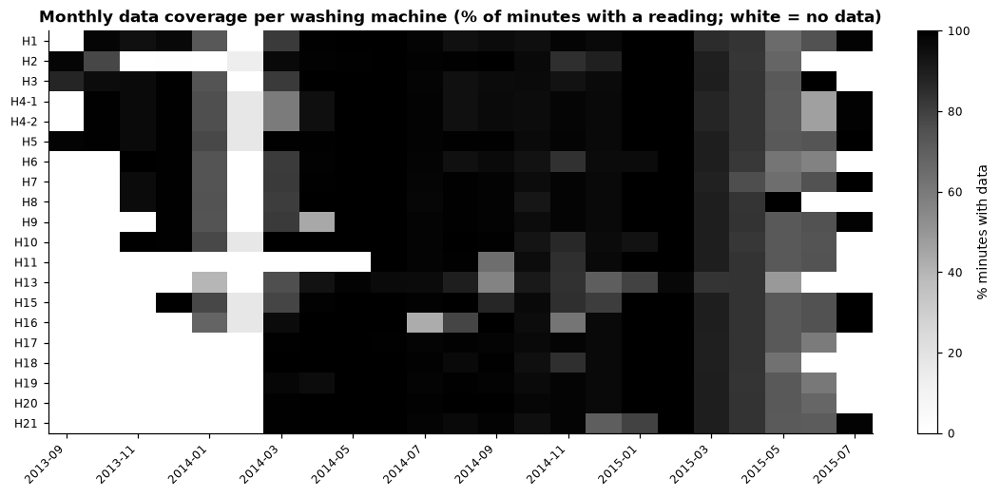
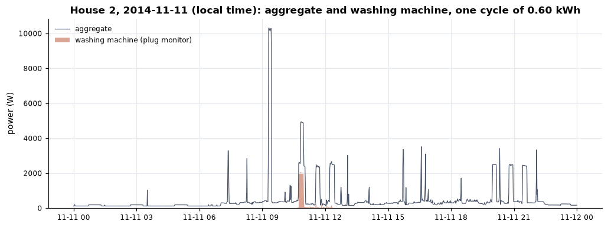
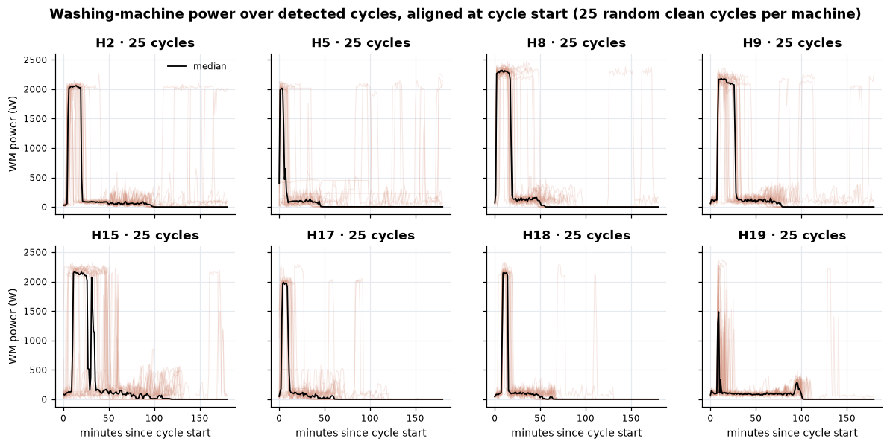
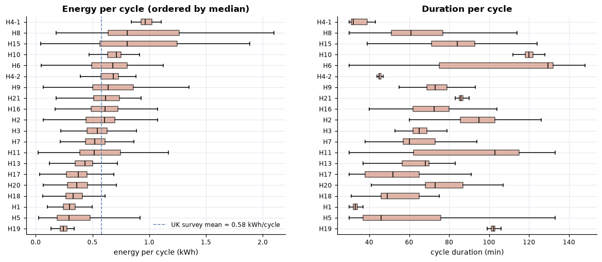
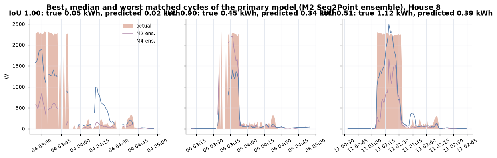
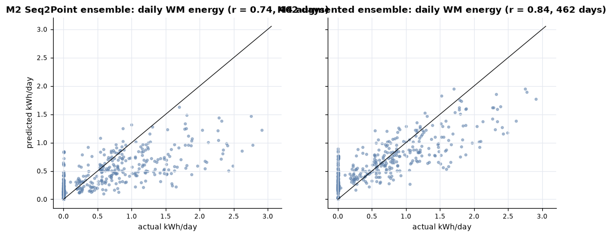
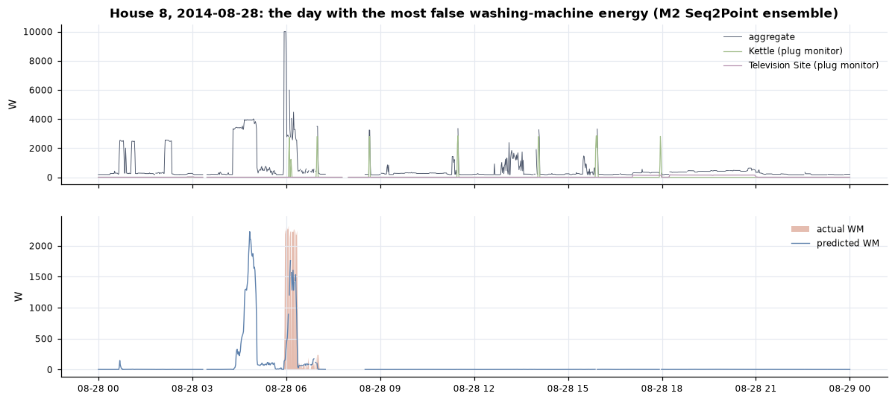
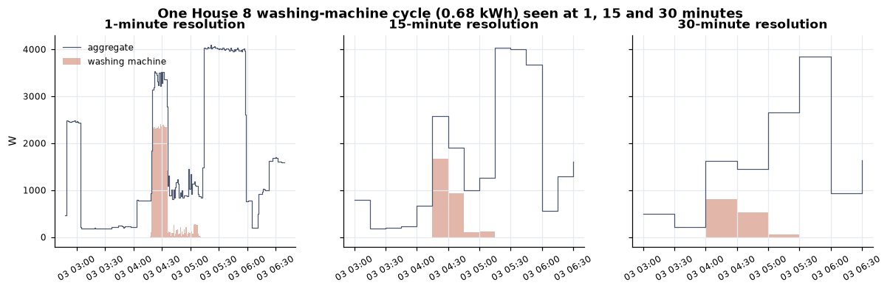

# RESULTS.md — washing-machine EDA, model results, validation and failure analysis

Every number below is produced by a notebook and saved under `artifacts/` (table names in
brackets). Data preparation and cleaning decisions are in [`DATA.md`](DATA.md).

## At a glance

* **Usage.** 6,334 clean washing cycles in 19 homes (20 machines). A typical wash lasts 68 minutes,
  peaks at 2.1 kW and uses 0.52 kWh; **76 % of washing-machine energy is water heating**. Washing is
  a morning activity: 44 % of cycles start 07:00–12:00 and only 13 % in the 16:00–19:00 peak.
* **Model.** A three-seed Seq2Point ensemble, evaluated on six homes it never saw, finds **75 % of
  real washing cycles** in the reference test home (House 8), cuts the daily energy error by 42 %
  relative to predicting nothing (335 vs 574 Wh/day) and has a 28 % error on total washing energy
  over 18 months. Across six unseen homes it beats every baseline on every energy metric.
* **Main weaknesses.** False cycles during unmetered high-power loads and kettles; under-estimated
  energy within real cycles (the long low-power tail); large differences between homes (NDE 0.42 to
  1.40).
* **Two negative results, reported as such:** gating the output by an on/off classifier made things
  worse; training with distractor appliances helped energy-weighted error but failed its
  pre-registered acceptance test on cycle detection.
* **15/30-minute meters.** A model that only sees 15- or 30-minute data loses its skill (worse than
  predicting zero per interval); 1-minute input is what makes washing-machine disaggregation work.
* **A data finding that matters for anyone using REFIT:** the official `Issues` flag removes 5–47 % of
  washing-machine-on minutes (5–50 % of washing energy) in the training homes.

---

## 1. Washing-machine EDA (Requirement 2, notebook 02)

**Homes and coverage.** 19 of the 20 REFIT homes have a washing-machine monitor (House 12 has
none); House 4 has two machines in simultaneous use, so 20 machines are analysed. Records span
13–22 months per home (Sep 2013 – Jul 2015); 75–94 % of minutes carry a reading. Outages appear in
the cleaned release as missing rows or as forward-filled flat lines; both are treated as missing
[`nb02_coverage_quality.csv`]. The washing machine is drawing less than 20 W in 91–99.7 % of valid
minutes.

**Cycle rule.** A cycle is power ≥ 20 W, with off-gaps shorter than 3 minutes bridged and a minimum
length of 30 minutes (Kelly & Knottenbelt 2015, ported to 1-minute data as in Precioso &
Gómez-Ullate 2023); cycles above 3.12 kW (the 13 A plug limit), longer than 4 hours or touching
missing data are flagged and excluded from per-cycle statistics. Sensitivity
[`nb02_rule_sensitivity.csv`]: 10 W → +2 % cycles, 50 W → −7 %, NILMTK's metadata defaults → +14 %,
merging pauses up to 10 minutes → +0.2 %. The rule captures 80–99 % of each machine's energy (House 4
is the exception). A data-driven k-means threshold (≈ 1.06 kW) would detect only the heating phase,
so it is not used for cycles [`nb02_threshold_check.csv`].

| pooled over 6,334 clean cycles | value |
|---|---|
| duration, median (90th percentile) | 68 min (118 min) |
| peak power, median | 2.1 kW |
| energy per cycle, median / mean | 0.52 / 0.55 kWh (UK Household Electricity Survey ≈ 0.58 kWh) |
| cycles per week, median across machines | 4.0 (range 1.4–11.9) |
| share of WM energy drawn above 1.5 kW (water heating) | 76 % |
| cycles with ≥ 5 minutes of heating | 86 % |
| median energy, heated vs unheated cycles | 0.57 vs 0.19 kWh |

**(i) A representative day.** House 2, a training home with no PV or washer-dryer, chosen
programmatically (full coverage, no flat-line outage, typical daily energy, one cycle closest to the
home's median).

The wash is a ~2 kW heating block followed by a long 100–300 W tail with spin peaks. On this day the
heating block coincides with a 5 kW load from another appliance, and several other 2–2.5 kW blocks
of similar length appear later — the core difficulty for disaggregation.

**(ii) Power over detected cycles.**

Most machines share one shape: an early 10–25 minute heating plateau, a long low-power agitation
phase and spin bursts at the end. Homes differ in how often the heating plateau appears and in
programme length; House 19 mostly runs unheated washes.

**(iii) When washing happens** (local time; machines with ≥ 50 cycles weighted equally).

Washing is concentrated 07:00–12:00 (44 % of cycles), with the strongest cells on Saturday and
Monday mornings; weekends hold 33 % of cycles against 29 % of days. Only 13 % of cycles and 13 % of
washing energy start in the 16:00–19:00 network peak; 12 % start between 22:00 and 07:00.

**(iv) Energy and duration across homes.**

Leaving out House 4's rarely used second machine (18 clean cycles), median energy per cycle ranges
from 0.24 kWh (House 19, mostly unheated) to 0.81 kWh (Houses 8 and 15); median duration from 33
minutes (House 1) to 130 minutes (House 6). Estimated annual washing energy ranges from ~40 kWh
(House 18) to ~330 kWh (House 7) per machine, driven by frequency as much as by programme
[`nb02_per_home_stats.csv`].

---

## 2. Modelling approach and validation design (notebooks 03–05b)

**Task.** Estimate washing-machine power each minute from the whole-home 1-minute aggregate alone.

**Split** [`nb03_split_manifest.json`, `nb03_leakage_audit.csv`]:

| role | homes | purpose |
|---|---|---|
| train | 2, 5, 7, 9, 15, 16, 17 — first ~80 % of each record | fitting |
| seen-home test | same homes, last ~20 %, after a 1-day + 1-window embargo | how much skill is home-specific |
| validation | 18 | early stopping, window, loss weight, augmentation rate, choice of primary model |
| unseen test | **8** (reference REFIT test home) + 1, 6, 10, 19, 20 | scored once, at the end |

This is the house split used for REFIT washing machines since D'Incecco et al. (2020); the five
extra homes are every remaining home with one washing machine, no PV and no documented machine
change. Leakage controls: splits by home; no window crosses a split or home (audited: zero);
normalisation from training targets only; inputs are the aggregate only; all choices on House 18.

**Why these metrics.** The washing machine is off ~97 % of the time, so MAE rewards predicting
nothing: on House 8 "always off" has MAE 24.6 W, the best model 23.6 W. I therefore report
energy-normalised error (**NDE**; 1.0 = predicting zero), total and daily energy error (**SAE**,
**EpD**), minute-level **F1** at 20 W, **cycle-level** precision/recall/F1 (cycles detected with the
EDA rule on truth and prediction and matched at temporal IoU ≥ 0.5 — a project-specific metric,
since NILM has no standard one), and the share of true energy **recovered** vs false energy
**added**.

**Models.**

| | model | why |
|---|---|---|
| M0a / M0b | always-off; weekday × hour usage profile | metric floors: no signal / behaviour only |
| M1 | LightGBM on window statistics of the aggregate | strong classical baseline |
| M2 | Seq2Point CNN (Zhang et al. 2018), W = 81 min | the most replicated NILM model on REFIT washing machines; window chosen on validation (81 beat 237) |
| M3 | Seq2Point with an on/off gate (Shin et al. 2019) | one change aimed at false power while off |
| M4 | Seq2Point trained with real distractor activations (dishwasher, tumble dryer, washer-dryer, kettle) + sparse WM insertions (Kelly & Knottenbelt 2015; Rafiq et al. 2021) | one change aimed at the diagnosed cause of false positives |
| ensembles | mean of the three seeds of M2 / M4 | variance reduction |

**Validation results (House 18)** [`nb04_validation.csv`, `nb05_ablation_val.csv`, `nb05b_comparison_val.csv`]:

| model (mean of 3 seeds) | NDE | cycle F1 | true energy recovered | extra energy |
|---|---|---|---|---|
| always-off | 1.00 | 0 | 0 % | 0 % |
| LightGBM | 0.87 | 0.34 | 28 % | 337 % |
| Seq2Point (M2) | 0.68 ± 0.05 | 0.60 ± 0.02 | 61 % | 98 % |
| gated (M3) | 0.83 ± 0.03 | 0.47 ± 0.04 | 55 % | 133 % |
| augmented (M4) | 0.61 ± 0.08 | 0.57 ± 0.08 | 67 % | 168 % |
| **M2 seed ensemble (primary)** | **0.60** | **0.64** | 62 % | 97 % |

* **The gate (M3) is a negative result.** It peaks after 2–4 epochs and then degrades: the on/off
  head learns home-specific cues, and in a new home a confident gate turns an ambiguous 2 kW event
  into a full-power false cycle, where plain Seq2Point hedges.
* **Diagnosis before the next change.** On House 18, 48 % of Seq2Point's false energy occurs while
  the dishwasher runs (it also heats water at ~2 kW), and about a third is low-level power during
  quiet periods [`nb05b_false_energy_attribution_val.csv`].
* **Augmentation (M4) failed its pre-registered rule.** It had to beat M2 by more than M2's seed
  spread on both NDE (it did: −0.061) and cycle F1 (it did not: −0.034). It recovers more true
  energy but adds much more false energy; the washing-machine insertions likely raised its learned
  on-rate.
* **Primary model: the M2 seed ensemble**, fixed before the test homes were scored.

---

## 3. Results on unseen homes (notebook 06)

**House 8** [`nb06_house8_mean.csv`; single deep models: mean ± sd of 3 seeds]:

| model | NDE | SAE | EpD (Wh/day) | F1 | cycle F1 | cycle recall | energy recovered | extra energy |
|---|---|---|---|---|---|---|---|---|
| always-off | 1.00 | 1.00 | 574 | 0 | 0 | 0 | 0 % | 0 % |
| weekday × hour profile | 1.00 | 0.35 | 536 | 0.05 | 0.03 | 0.08 | 2 % | 63 % |
| LightGBM | 1.01 | 0.50 | 531 | 0.05 | 0.02 | 0.02 | 2 % | 48 % |
| Seq2Point (single) | 0.77 ± 0.01 | 0.28 | 340 | 0.51 | 0.56 ± 0.04 | 0.64 | 37 % | 34 % |
| gated | 0.77 ± 0.03 | 0.23 | 347 | 0.45 | 0.37 | 0.44 | 41 % | 46 % |
| augmented | 0.69 ± 0.02 | 0.18 | 309 | 0.45 | 0.53 | 0.82 | 49 % | 53 % |
| **Seq2Point ensemble (primary)** | **0.74** | **0.28** | **335** | **0.49** | **0.56** | **0.75** | **38 %** | **34 %** |
| augmented ensemble | 0.66 | 0.02 | 292 | 0.43 | 0.47 | 0.85 | 49 % | 53 % |

For context only (8-second data, so not comparable): published House 8 results are Seq2Point MAE
16.9 W (D'Incecco et al. 2020) and 21.9 W with F1 0.61 (Langevin et al. 2022).

**All six unseen homes (mean), and seen homes** [`nb06_unseen_mean.csv`, `nb06_seen_vs_unseen.csv`, `nb06_unseen_nde_per_home.csv`]:

| model | NDE unseen | EpD unseen | SAE unseen | cycle F1 unseen | NDE seen | generalisation loss (NDE) |
|---|---|---|---|---|---|---|
| always-off | 1.00 | 308 | 1.00 | 0 | 1.00 | 0 % |
| LightGBM | 1.11 | 356 | 1.30 | 0.05 | 0.79 | 40 % |
| Seq2Point ensemble (primary) | **0.83** | **181** | **0.31** | **0.48** | 0.57 | 45 % |
| augmented ensemble | 0.91 | 178 | 0.52 | 0.48 | 0.56 | 63 % |

| NDE of the primary model per unseen home | 6 | 10 | 8 | 20 | 1 | 19 |
|---|---|---|---|---|---|---|
| | 0.42 | 0.71 | 0.74 | 0.83 | 0.86 | 1.40 |

**Actual vs predicted** (House 8, three consecutive days with the most cycles):

The models find the heating blocks reliably and under-predict the long low-power tail. Daily
washing energy predicted vs actual: r = 0.74 (primary model), 0.84 (augmented ensemble).

## 4. Failure analysis

**House 8, primary model** [`nb06_failure_taxonomy_house8.csv`]:

| | count | detail |
|---|---|---|
| true cycles | 310 | |
| found (matched) | 232 (75 %) | energy within found cycles under-predicted by 59 % |
| missed | 78 | smaller cycles: median 0.46 vs 0.76 kWh for found ones |
| false cycles | 281 | at those times the largest metered load was: nothing metered (193 → unmetered load, e.g. electric shower or cooking), kettle (32), washer-dryer (19), microwave (19), TV (13) |

**Failure modes, in order of impact.**
1. **Overlapping signatures.** Any ~2 kW resistive load lasting minutes (dishwasher heating, kettle,
   washer-dryer, unmetered shower or oven) resembles the washing machine's heating phase. Most
   false cycles happen during such loads, and most of them are not even plug-monitored (House 8's
   monitors explain only ~20 % of its consumption; noise-to-aggregate ratio 80 %).
2. **The low-power tail.** After heating, a wash draws 100–300 W for an hour, comparable to
   background noise. The model under-predicts it, so matched-cycle energy is 59 % low.
3. **Programme mix.** In House 19, which mostly runs unheated washes, the model still predicts
   heating-level power, so NDE is worse than predicting zero (1.40) even though cycle F1 is the
   best of all homes (0.74): it finds the cycles but mis-sizes them.
4. **Home-specific cues.** Error rises 45 % (NDE) from seen to unseen homes; the gate and the
   augmentation both overfit the training homes within a few epochs.

**Post-processing trade-off** [`nb06_activation_filter_unseen.csv`]: removing predicted power
outside predicted cycles of ≥ 30 minutes lowers false energy from 59 % to 17 % of true energy and
raises minute precision from 0.41 to 0.54, but recovered energy falls from 42 % to 28 %. Use it to
count cycles, not to report energy.

## 5. Missing labels, appliance changes and unmetered loads

* **Missing labels.** Outages and forward-filled flat lines are never used as targets. The official
  `Issues` flag (plug monitors summing above the aggregate) is the bigger issue: computed per 8-second
  row, it fires whenever a large appliance switches, so it removes **5–47 % of washing-machine-on
  minutes and 5–50 % of washing energy** in the training and validation homes, against 1–8 % of all
  minutes [`issues_flag_vs_wm_on_trainval.csv`]. I followed the README and excluded flagged minutes;
  this thinned the positive labels and fragmented true cycles. On House 1, scoring against my own
  cleaning of the raw data (flag computed on 1-minute means) gives cycle F1 0.38 vs 0.17 on the
  official release, although the two label series agree on on/off state in all but 72 minutes
  [`nb06_house1_official_vs_mine.csv`]. For House 8 (low flag rate) including the flagged minutes
  changes NDE only from 0.737 to 0.726. **First change for a next version:** keep these minutes and
  use the flag as a weight, re-validated from scratch.
* **Appliance changes.** House 13 (machine replaced) and House 4 (two machines) were excluded. A
  replaced machine with a different heater or programmes shifts the signature; the model would need
  re-validation, which is why the service's model card lists it as a limit.
* **Unmetered loads.** Plug monitors explain only 20–53 % of each home's energy; the rest is
  invisible to labelling and is the largest source of false cycles (section 4).

## 6. What 15- or 30-minute data would change (Requirement 4)

[`nb06_resolution_mean_unseen.csv`, `nb06_resolution_house8.csv`]

| six unseen homes, mean | evaluated at | NDE | EpD (Wh/day) | interval F1 |
|---|---|---|---|---|
| primary model, 1-minute input | 1 min | 0.83 | 181 | 0.51 |
| same, output averaged | 15 min | 0.92 | 173 | 0.51 |
| same, output averaged | 30 min | 0.87 | 176 | 0.52 |
| Seq2Point trained on 15-minute input | 15 min | 1.27 | 274 | 0.22 |
| Seq2Point trained on 30-minute input | 30 min | 1.14 | 264 | 0.23 |
| always-off | any | 1.00 | 308 | 0 |

At 15–30 minutes a 2 kW, 15-minute heating block becomes one or two averaged values that look like
any other load, and the tail disappears. A model that only sees such data has no per-interval skill
(worse than predicting zero) and roughly halves its advantage on daily energy. This matches the
literature: washing-machine *detection* at 30 minutes reaches only ~0.6 macro-F1 even as a
day-level classification task (Petralia et al. 2023), and hourly disaggregation works only for
coarse energy totals (Zhao et al. 2020). With 15/30-minute utility data the realistic products are
"did this home wash today / this week" and monthly energy estimates validated against a panel with
1-minute or plug-level data — not cycle timing or per-cycle energy.

## 7. Limitations

* **Overlapping signatures.** Dishwashers, washer-dryers, kettles, showers and ovens share the
  washing machine's heating signature; with active power alone and a 1-minute rate they are often
  indistinguishable. Reactive power or current harmonics (motor vs resistive load) would separate
  them far better.
* **Missing data.** 11–27 % of minutes per home are unusable; outages cluster (e.g. 41 days in
  Jan–Mar 2014), and the `Issues` flag interacts with the target (section 5).
* **1-minute resolution.** Adequate for heating blocks, marginal for the low-power tail and short
  spin bursts; 8-second data or higher-rate current features would recover them.
* **Household behaviour.** Frequency (1.4–11.9 cycles/week) and programme choice (heated vs
  unheated) vary more between homes than the model can absorb from seven training homes; error
  varies threefold across unseen homes.
* **UK → India.** Nominal supply is the same (230 V, 50 Hz), but Indian supply voltage swings widely
  (180–260 V measured in Delhi's iAWE home), which changes a resistive heater's power with V²; many
  machines are semi-automatic twin-tubs or cold-fill top-loaders without an internal heater, so the
  2 kW heating block this model relies on is often absent; inverter/UPS backup and frequent outages
  distort the aggregate; washing-machine ownership is ~29 % in urban and ~6 % in rural homes; and
  most smart meters report 15/30-minute blocks (section 6). The model should not be used in India
  without local labelled data; the realistic path is fine-tuning the dense layers on a small
  plug-metered panel (D'Incecco et al. 2020 show this for cross-dataset transfer) with per-window
  amplitude normalisation and voltage-scaling augmentation.
* **Sample size.** Seven training homes, one validation home and six test homes from one town in
  2013–2015; results on a different housing stock or appliance generation may differ.

## 8. What I would do next, in order

1. Keep the `Issues` minutes as labels (with a weight) and rebuild the training targets.
2. Distractor-only augmentation (no washing-machine insertions) with three seeds — the likely fix
   for M4's inflated on-rate.
3. A Transformer with per-window normalisation (NILMFormer, KDD 2025), which reports lower 1-minute
   errors on REFIT.
4. Add reactive power / current features from Flock's own meters, where available.
5. A calibrated probability head and per-home drift monitoring in the service.
